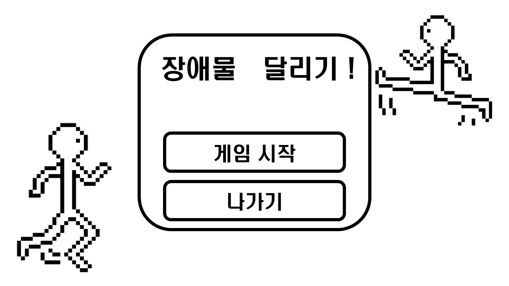
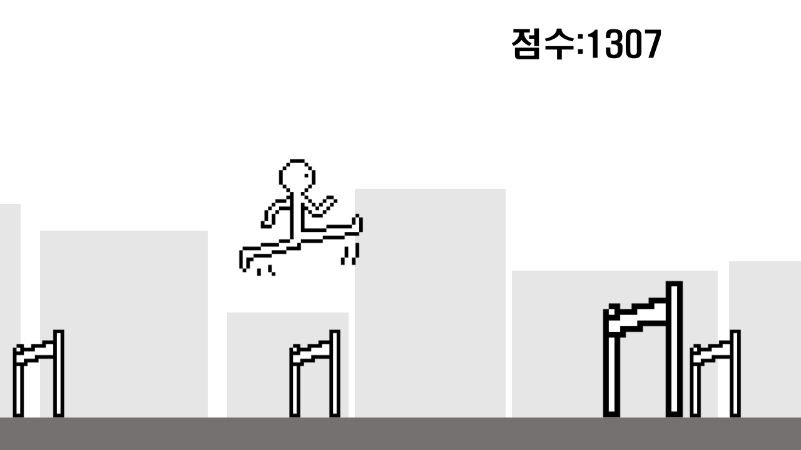
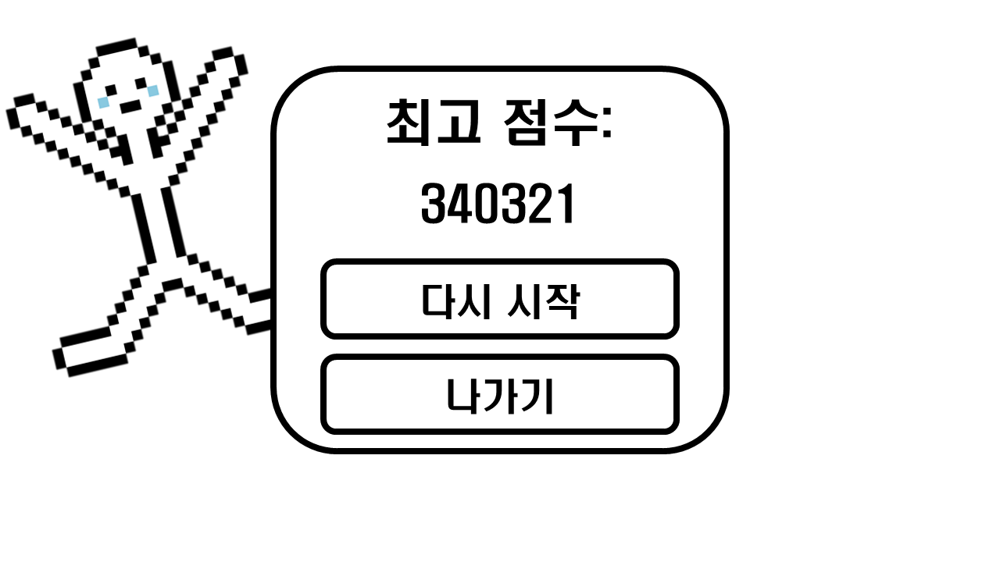

# 게임 기획서: 점프 러너 (Jump Runner)

 김동우 (학번: 26031008)

---

##  게임 개요

본 게임은 **자동으로 앞으로 진행하는 캐릭터**를 조작하여 장애물을 점프로 피하고, 가능한 한 오랜 시간 생존하여 높은 점수를 획득하는 **무한 러너(Infinite Runner)** 장르의 2D 게임입니다.

---

##  승리 / 패배 조건

* **승리 조건**: 별도의 승리 조건은 없으며, 플레이어가 장애물에 부딪혀 패배하기 전까지 무한으로 게임이 진행됩니다.
* **패배 조건**: 플레이어가 진행 방향에 위치한 장애물에 닿으면 즉시 패배(게임 종료)합니다.

---

##  핵심 시스템

1. **자동 전진**
   * 플레이어 캐릭터는 자동으로 전진합니다.
2. **점수 및 속도 증가**
   * 이동한 거리에 비례하여 **점수**가 지속적으로 상승합니다.
   * 이동 거리가 늘어남에 따라 **이동 속도가 점차 빨라져** 난이도가 상승합니다.
3. **점프 조작**
   * 플레이어는 장애물을 피하기 위해 **점프** 동작만 수행할 수 있습니다.
4. **게임 오버**
   * 장애물과 충돌 시 게임이 종료되며 결과 화면이 출력됩니다.

---

##  조작법 (Controls)

| 동작 | 키보드 입력 |
| --- | --- |
| **점프 (Jump)** | `Space` (스페이스바) |

---

##  필요 리소스

###  그래픽 이미지
* **플레이어 캐릭터**: 런닝 및 점프 모션
* **장애물**: 플레이어가 피해야 하는 오브젝트
* **인게임 점수판**: 현재 진행 점수 표시 UI
* **게임 종료 점수판**: 게임 오버 후 최종 획득 점수 및 통계 표시 UI

###  사운드 효과음
* **점프 사운드**: 플레이어가 점프할 때 재생된다
* **점수 달성 사운드**: 일정 점수 달성을 알려주는 사운드